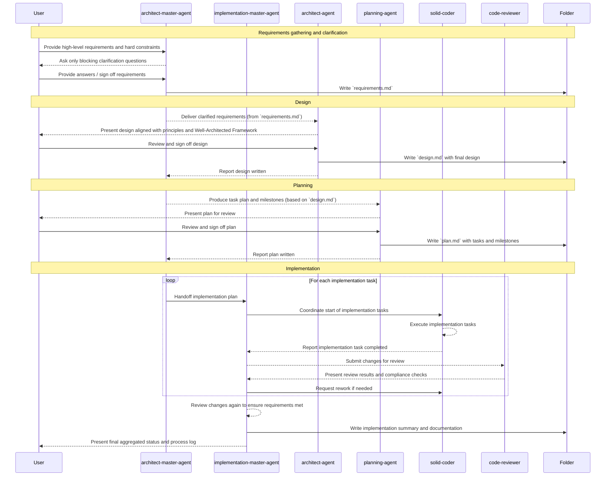

# AI Agentic Workflow design

## My usage

- Work
  - Analyze requirements: clarity objectives/AC, define existing and missing resources
  - Design, planning
  - Implementation
    - IaC Pulumi + Go + Azure implementation
    - CDK + Typescript + AWS implementation
    - Estimate DevOps effort & infrastructure cost, draw diagram
    - DevOps tasks planning reviewed with Well Architected Framework
    - Documentation
  - Review
- Personal projects
  - IaC Pulumi + Go/Typescript for AWS
  - Rust, Go development (pure code, no vibe coding)
- Learning English
  - Following my learning system

## Additional requirements

- Front-loading accuracy: Analyze and clarify requirements before starting
- Clear separation of concerns: analyze requirements, design, implementation, review
- Predicting Impact & Guardrails to prevent negative outcomes, fail fast

## Success criteria

- Automation: avoid manual work, automate as much as possible
- Error: avoid issues and rework

## Workflows

### Coding/devops tasks:

#### Master agents

- architect-master-agent
  - Clarifies requirements, then delegates to architect-agent and planning-agent
- implementation-master-agent
  - Delegates to solid-coder and code-reviewer

#### Requirements for each agent

- architect-agent:
  - Break down the system into components/modules with clear responsibilities.
  - Output design includes diagrams, data flow, and technology choices aligned with best practices.
- planning-agent:
  - Create a detailed task list with
    - Task description
    - Resources needed (tools, information, files,...)
    - Subtasks as detailed steps
    - AC
  - Split to phases if the task scope is large.
- solid-coder:
  - Follow best coding practices, ensure code quality, maintainability, and security.
  - Write comment only where necessary to explain complex logic.
  - Should run tools to check code quality, security, and compliance before reporting task completion.
- code-reviewer:
  - Perform thorough code reviews, checking for adherence to requirements, design, and coding standards.
  - Provide constructive feedback and suggest improvements.
  - Ensure all acceptance criteria are met before approving changes.
- architect-master-agent:
  - Clarify requirements, then coordinate design and planning phases.
  - Aggregate reports from architect-agent and planning-agent.
  - Stop immediately if negative impact/guardrail issues are detected
- implementation-master-agent:
  - Coordinate implementation and review phases.
  - Aggregate reports from solid-coder and code-reviewer.
  - Present final aggregated status and process log to the user.
  - Stop immediately if negative impact/guardrail issues are detected

### English learning system

Just use default opencode agent with defined `AGENTS.md` file about the system.
