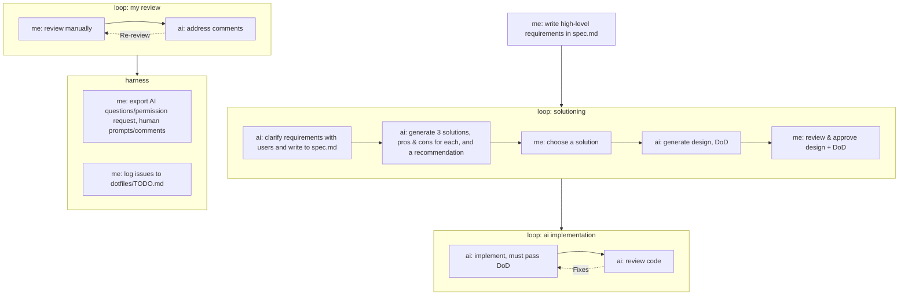

# AI Agentic Workflow design

This file is for brainstorming and designing the AI agentic workflow. The target is to create a workflow and harness system (skills, rules)

## Constraints

- Maximum automation but keep the quality
- Definition of quality: meet all DoD (Definition of Done)
- Must keep the human in the loop for quality assurance and decision making

## Workflows

```mermaid
graph TD
    %% Main Flow Sequence
    REQS[me: write high-level requirements in spec.md] --> SOLUTIONING

    %% Solutioning Loop Block
    subgraph SOLUTIONING [loop: solutioning]
        D1[ai: clarify requirements with users and write to spec.md] --> D2[ai: generate 3 solutions, pros & cons for each, and a recommendation]
        D2 --> D3[me: choose a solution]
        D3 --> D4[ai: generate design, DoD]
        D4 --> D5[me: review & approve design + DoD]
    end

    %% Flow to Implementation
    SOLUTIONING --> IMPL

    %% AI Implementation Loop Block
    subgraph IMPL [loop: ai implementation]
        I1[ai: implement, must pass DoD] --> I2[ai: review code]
        I2 -.->|Fixes| I1
    end

    %% My Review Loop Block
    subgraph REVIEW [loop: my review]
        R1[me: review manually] --> R2[ai: address comments]
        R2 -.->|Re-review| R1
    end

    %% Flow to Harness
    REVIEW --> HARNESS

    %% Harness Section Block
    subgraph HARNESS [harness]
        H1[me: export AI questions/permission request, human prompts/comments]
        H2[me: log issues to dotfiles/TODO.md]
    end
```

- Solutioning block: from requirements to design (include test cases, may be test scripts or test scenario performed by me) and DoD
- Implementation block: from design to implementation, must pass DoD
- Harness block: from agent questions/permission request, my answers/prompts to enhance AI harness system
  - skills
  - Global AGENTS.md
  - Project AGENTS.md
