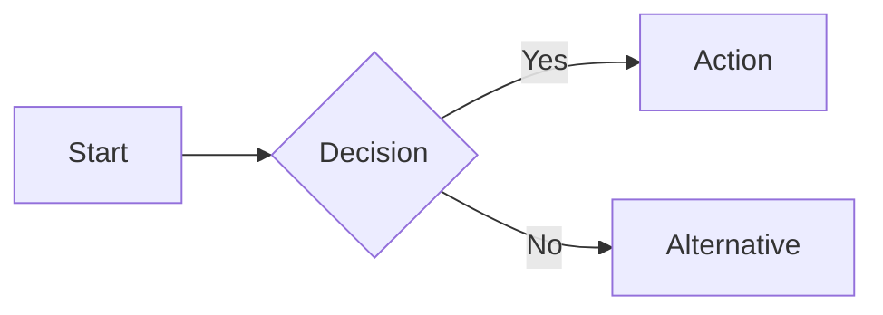
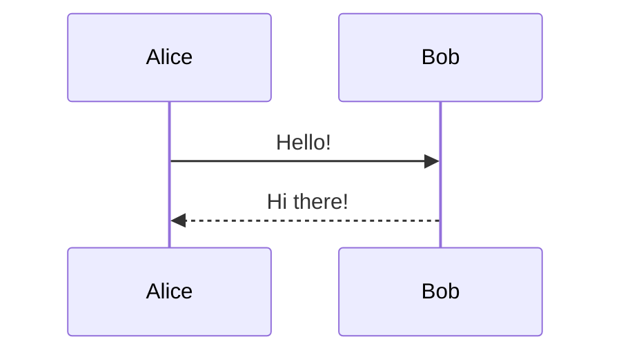
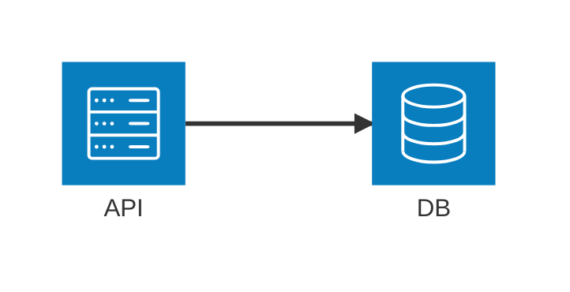
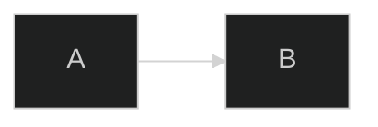
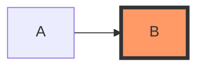
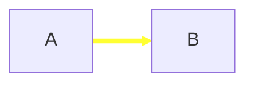

# Mermaid Diagramming Expert

Expert in creating diagrams using Mermaid.js syntax for flowcharts, sequence diagrams, architecture diagrams, and more.

## Overview

Mermaid is a JavaScript-based diagramming and charting tool that renders Markdown-inspired text definitions to create and modify diagrams dynamically. It allows you to create diagrams using simple text syntax.

## When to Use This Skill

- Creating flowcharts to visualize processes and workflows
- Designing sequence diagrams for software interactions
- Building architecture diagrams for cloud/CI-CD deployments
- Generating class diagrams, state diagrams, ER diagrams
- Creating Gantt charts, pie charts, and other visualizations
- Rendering diagrams from CLI using mermaid-cli (mmdc)

## Quick Reference

### Supported Diagram Types

1. **Flowcharts** - Processes, workflows, decision trees
2. **Sequence Diagrams** - Software interactions, API flows
3. **Architecture Diagrams** - Cloud/CI-CD infrastructure (v11.1.0+)
4. **Class Diagrams** - Object-oriented design
5. **State Diagrams** - State machines
6. **Entity Relationship Diagrams** - Database schemas
7. **Gantt Charts** - Project timelines
8. **Pie Charts, Timelines, Mindmaps** - And many more

### Basic Syntax Examples

**Flowchart:**



**Sequence Diagram:**



**Architecture Diagram:**



## CLI Usage

The `mmdc` command renders Mermaid diagrams to SVG, PNG, or PDF.

**Basic conversion:**

```bash
mmdc -i diagram.mmd -o output.svg
```

**With theme and background:**

```bash
mmdc -i diagram.mmd -o output.png -t dark -b transparent
```

**Architecture diagrams with cloud icons:**

```bash
mmdc -i arch.mmd -o arch.svg --iconPacks @iconify-json/logos
```

See `references/mermaid-cli.md` for complete CLI documentation.

## Best Practices

1. **Clarity**: Use meaningful IDs and labels
2. **Simplicity**: Break complex diagrams into smaller focused ones
3. **Consistency**: Maintain naming conventions and flow direction
4. **Documentation**: Add comments with `%%` for maintainability
5. **Formatting**: Use markdown strings for **bold** and _italic_ text (v11.3.0+)

## Configuration

**Inline configuration:**



**Via config file:**

```bash
mmdc -i diagram.mmd --configFile config.json
```

## Styling

**Apply classes:**



**Style links:**



## Troubleshooting

| Issue                        | Solution                              |
| ---------------------------- | ------------------------------------- |
| "end" keyword breaks diagram | Use `(end)`, `[end]`, or `{end}`      |
| Special characters in labels | Enclose in quotes: `"text"`           |
| Unicode text issues          | Use double quotes: `"你好"`           |
| Icons not showing            | Register icon packs or use defaults   |
| Architecture icons missing   | Use `--iconPacks @iconify-json/logos` |

## Reference Documentation

Detailed documentation available in `references/` directory:

- **`architecture.md`** - Architecture diagram syntax, components, icons, edge routing
- **`flowchart.md`** - Node shapes, arrows, subgraphs, styling, advanced features
- **`sequence-diagram.md`** - Participants, messages, activations, loops, styling
- **`mermaid-cli.md`** - CLI installation, options, Docker usage, transformations

## Resources

- Official docs: https://mermaid.js.org/
- Live editor: https://mermaid.live/
- Icon search: https://iconify.design/

## Version Compatibility

- Architecture diagrams: v11.1.0+
- Expanded flowchart shapes: v11.3.0+
- Edge IDs and animations: v11.10.0+
- Bidirectional arrows: v11.0.0+
- Actor creation/destruction: v10.3.0+
