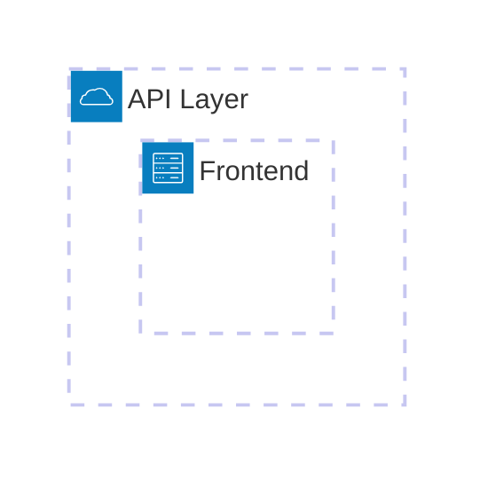
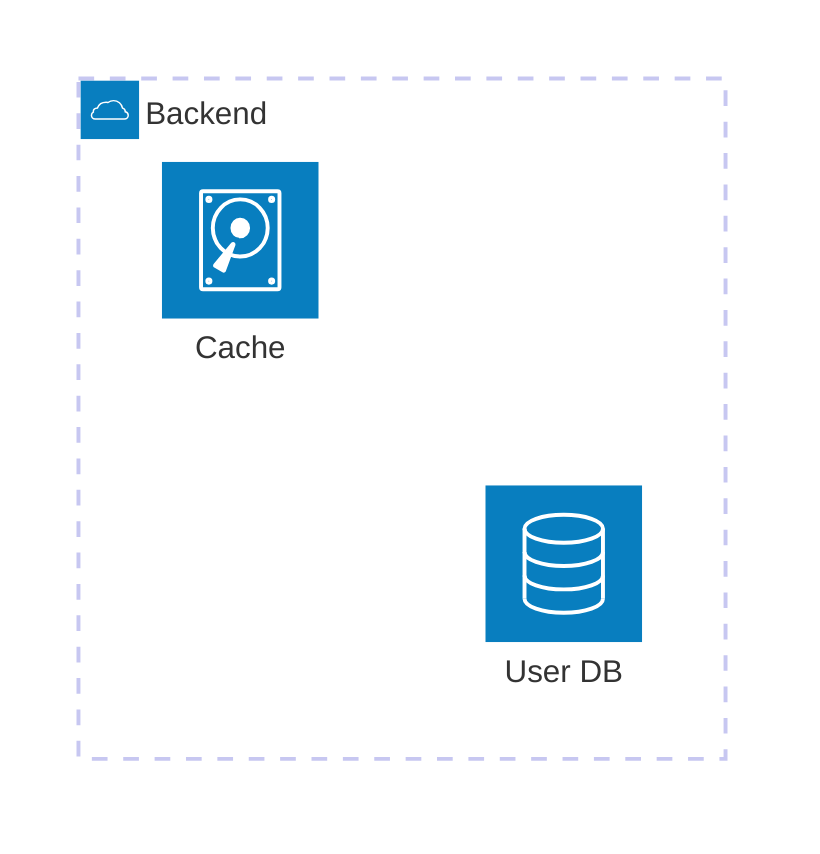
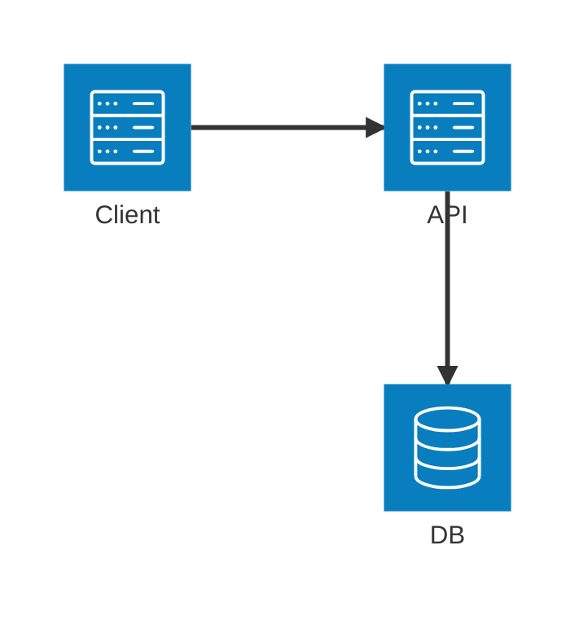
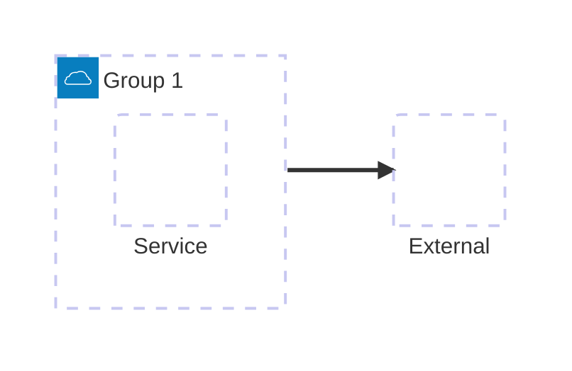
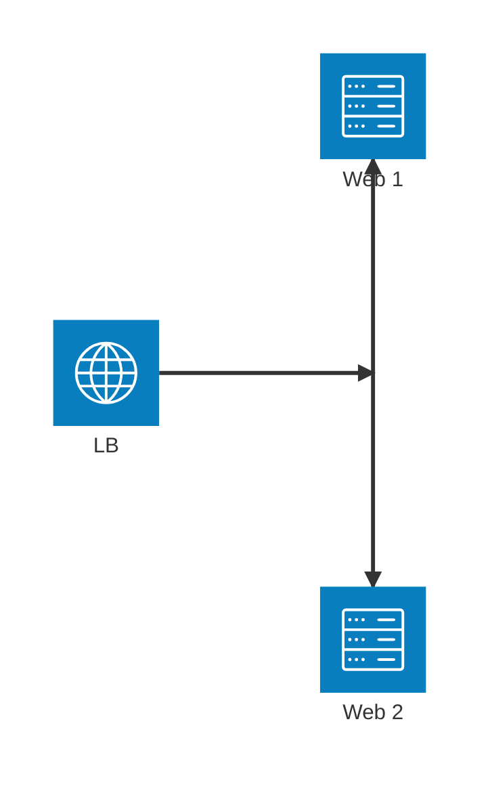
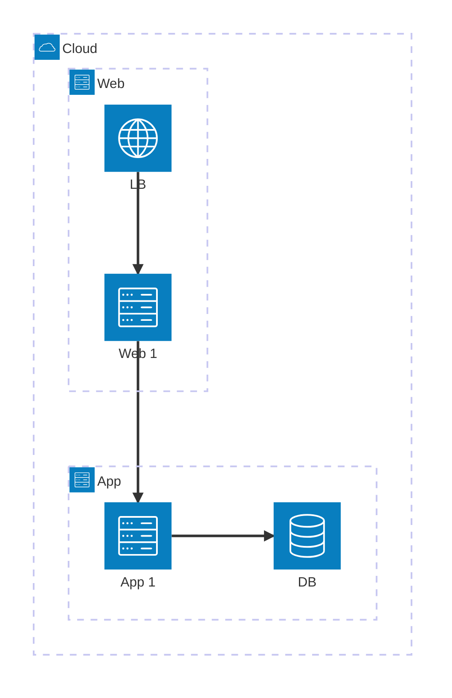
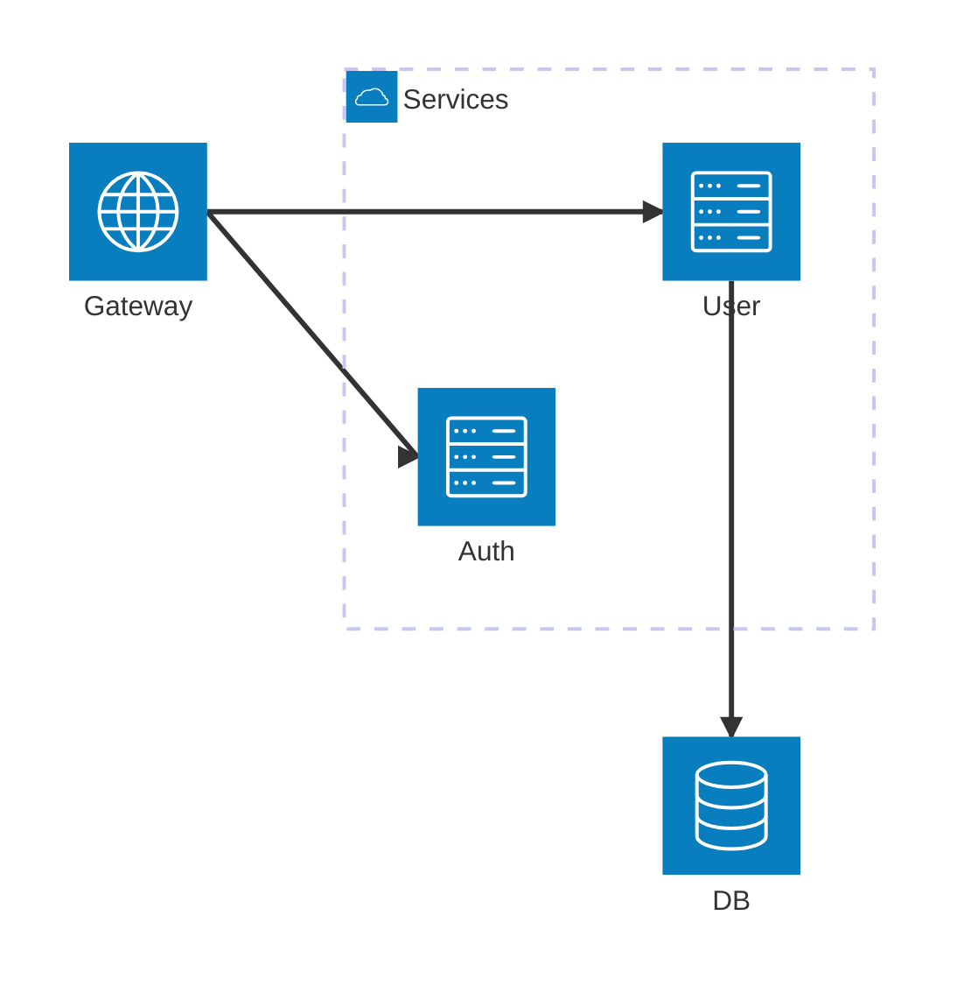

# Architecture Diagrams Reference

Architecture diagrams for Cloud/CI/CD deployments. Four building blocks: **Groups** (containers), **Services** (components), **Edges** (connections), **Junctions** (4-way routing).

**Requires**: v11.1.0+

```
architecture-beta
```

## Groups

**Syntax**: `group {id}({icon})[{title}] (in {parent_id})?`



## Services

**Syntax**: `service {id}({icon})[{title}] (in {parent_id})?`



## Edges

**Syntax**: `{serviceId}{group}?:{T|B|L|R} {<}?--{>}? {T|B|L|R}:{serviceId}{group}?`

**Directions**: `T` (top), `B` (bottom), `L` (left), `R` (right)  
**Arrows**: `--` (none), `-->` (right), `<--` (left), `<-->` (bidirectional)



**Group edges**: Use `{group}` modifier for edges from group boundaries (not direct `groupId`).



## Junctions

4-way routing points for complex flows (load balancing, message fanout, network routing).

**Syntax**: `junction {id} (in {parent_id})?`



## Icons

**Built-in**: `cloud`, `database`, `disk`, `internet`, `server`

**Custom icons** from [iconify.design](https://iconify.design) (200k+ icons):

```bash
npm install @iconify-json/logos
mmdc -i diagram.mmd --iconPacks @iconify-json/logos -o output.svg
```

```javascript
import mermaid from "mermaid";
import logos from "@iconify-json/logos";

mermaid.registerIconPacks([
  {
    name: "logos",
    loader: () => Promise.resolve(logos),
  },
]);
```



```mermaid
architecture-beta
    service aws(logos:aws)[AWS]
    service k8s(logos:kubernetes)[K8s]
```

**Popular packs**: `@iconify-json/logos`, `@iconify-json/mdi`, `@iconify-json/fa`

## Examples

**Three-tier architecture**:



**Microservices**:



## Best Practices

- **Organization**: Group by tiers/regions, use clear IDs, limit nesting to 3-4 levels, max 5-10 services per group
- **Edges**: Always specify T/B/L/R directions, minimize crossings, use junctions for complex routing
- **Icons**: Use consistent icon set, register custom packs for brands

## Troubleshooting

| Issue                | Solution                                                                                |
| -------------------- | --------------------------------------------------------------------------------------- |
| Icons not showing    | Register icon packs or use defaults (`cloud`, `database`, `disk`, `internet`, `server`) |
| Edges not connecting | Verify service IDs and directions (T/B/L/R)                                             |
| Group edges failing  | Use `service{group}:dir --> dir:target`, not `groupId` directly                         |
| CLI icon errors      | Add `--iconPacks @iconify-json/logos`                                                   |

**Docs**: https://mermaid.js.org/syntax/architecture.html  
**Icons**: https://iconify.design/
