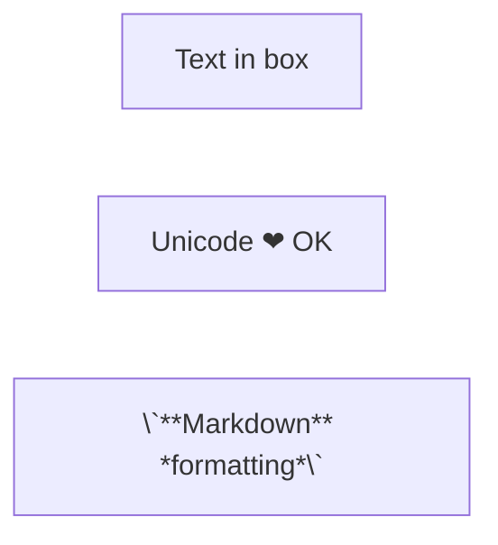
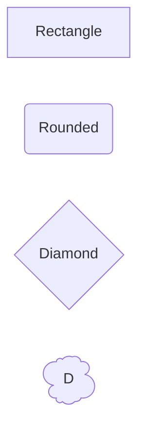
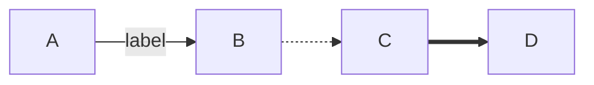
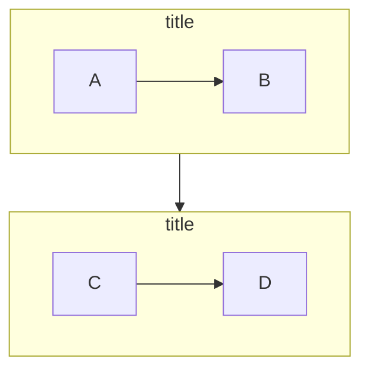
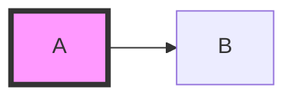

# Flowchart Reference

## Basic Syntax

**Declaration**: `flowchart {orientation}` or `graph {orientation}`

**Orientations**: `TD`/`TB` (top-down, default), `BT` (bottom-up), `LR` (left-right), `RL` (right-left)



## Node Shapes

**Classic syntax**: `id[text]`, `id(text)`, `id{text}`, `id((text))`, `id[(text)]`

**Common shapes**:

- `[text]` = Rectangle
- `(text)` = Rounded
- `([text])` = Stadium
- `{text}` = Diamond
- `((text))` = Circle
- `[(text)]` = Database
- `[[text]]` = Subroutine

**New syntax (v11.3.0+)**: `A@{ shape: shapeName }`

**Popular shapes**: `rect`, `rounded`, `stadium`, `diam` (diamond), `circle`, `cyl` (cylinder), `hex` (hexagon), `cloud`, `doc`



**Icon/Image shapes (v11.3.0+)**:

```mermaid
flowchart TD
    A@{ shape: icon, icon: "fa:user", form: "circle", h: 60 }
    B@{ img: "https://example.com/logo.png", h: 60 }
```

## Links

**Types**: `-->` (arrow), `---` (line), `-.->` (dotted), `==>` (thick), `~~~` (invisible), `--o` (circle), `--x` (cross), `<-->` (bidirectional)

**Text on links**: `A-->|text|B` or `A-- text -->B`

**Length**: Add dashes for spacing: `-->` (short), `--->` (medium), `---->` (long)

**Chaining**: `A --> B --> C` or `A --> B & C --> D`



**Edge IDs & animation (v11.3.0+)**:

```mermaid
flowchart LR
    A
    B
    e1@--> B
    e1@{ animation: fast }
```

**Curves (v11.10.0+)**: `basis`, `linear`, `step`, `stepBefore`, `stepAfter`

## Subgraphs



**Note**: Subgraphs inherit parent direction if nodes link externally.

## Styling

**Inline**: `style B fill:#f9f,stroke:#333,stroke-width:4px`

**Classes**:



**Link styling**: `linkStyle 0 stroke:#ff3,stroke-width:4px`

**Themes**: `default`, `dark`, `forest`, `neutral`, `base`


## Interaction

**Requires `securityLevel: 'loose'`**

**Clicks**: `click A "https://example.com" _blank "Tooltip"`  
**Comments**: `%% This is a comment`

## Best Practices

- **Descriptive IDs**: `userInput` not `a1`
- **Organization**: Group nodes in subgraphs, limit nesting to 2-3 levels
- **Text**: Keep labels 2-4 words, use `<br>` for line breaks
- **Styling**: Define reusable classes, limit colors to 3-5
- **Performance**: < 50 nodes per diagram, use elk renderer for complex flows (v9.4+)
- **Code structure**: Group definitions, connections, styling separately

## Troubleshooting

| Issue                      | Solution                                                                            |
| -------------------------- | ----------------------------------------------------------------------------------- |
| "end" breaks diagram       | Capitalize: `End` or `END`                                                          |
| Unwanted circle/cross edge | `A---oB` → `A--- oB` (add space) or `A---Ops` (capitalize)                          |
| Special chars break syntax | Use quotes: `["Text (with) #chars"]` or entities: `#35;` = #                        |
| Markdown not rendering     | Use backticks: `["\`**Bold**\`"]`                                                   |
| Subgraph direction ignored | Subgraph inherits parent if nodes link externally                                   |
| Animation not working      | Assign edge ID + set animation (v11.3.0+): `e1@--> B` then `e1@{ animation: fast }` |
| Clicks not working         | Set `securityLevel: 'loose'` in config                                              |
| Large diagrams poor        | Use elk renderer (v9.4+) or split diagram                                           |
| Text overflow              | Use markdown auto-wrap `["\`text\`"]`or`<br>`                                       |

**Debug**: Test at [mermaid.live](https://mermaid.live/), check console errors

**Gotchas**:

- ❌ `end` → ✅ `End`
- ❌ `A---oB` → ✅ `A--- oB`
- ❌ Special chars → ✅ `["chars"]`

**Docs**: https://mermaid.js.org/syntax/flowchart.html
