# Sequence Diagram Reference

Shows how processes operate with one another and in what order.

## Basic Syntax

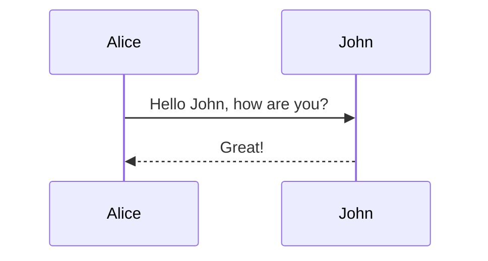

**Note**: Word "end" can break diagrams—enclose in `(end)`, `"end"`, `[end]`, or `{end}`.

## Participants

**Implicit** (order of first use) or **explicit**:

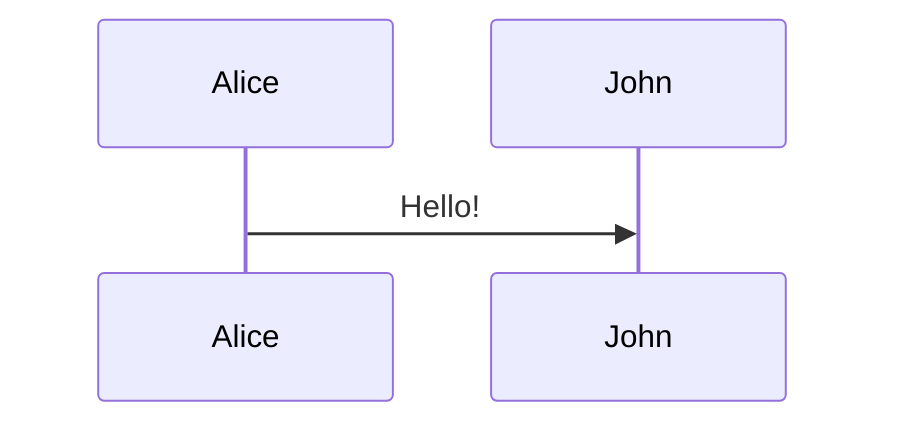

**Types**: `participant` (rectangle), `actor` (stick figure), or with `<<type>>`:

| Type        | Syntax                                      | Symbol       |
| ----------- | ------------------------------------------- | ------------ |
| Default     | `participant Name`                          | Rectangle    |
| Actor       | `actor Name`                                | Stick figure |
| Database    | `participant "DB" as DB <<database>>`       | Cylinder     |
| Queue       | `participant "MQ" as MQ <<queue>>`          | Queue        |
| Boundary    | `participant "API" as A <<boundary>>`       | Boundary     |
| Control     | `participant "Ctrl" as C <<control>>`       | Control      |
| Entity      | `participant "User" as U <<entity>>`        | Entity       |
| Collections | `participant "Users" as UC <<collections>>` | Collections  |

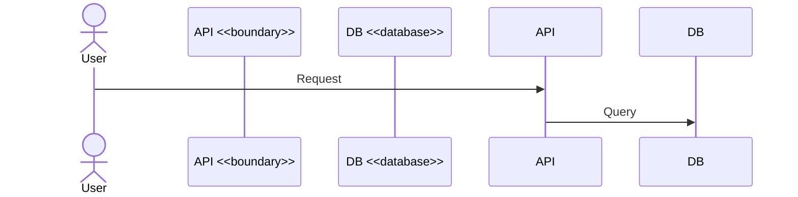

## Actor Creation/Destruction (v10.3.0+)

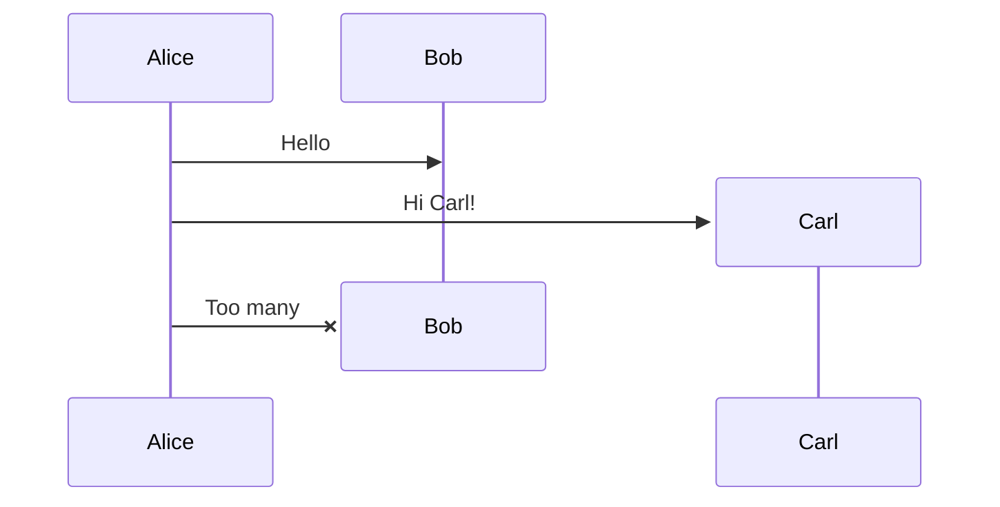

## Grouping (Boxes)

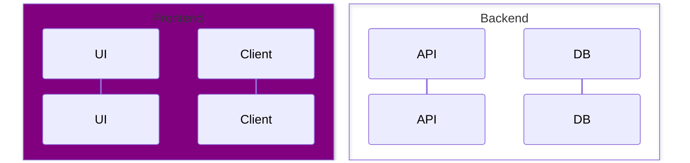

**Colors**: Named (`Purple`, `Aqua`), RGB (`rgb(33,66,99)`), RGBA, `transparent`

## Messages

**Arrow types**:

| Syntax   | Description                     |
| -------- | ------------------------------- |
| `->`     | Solid line                      |
| `-->`    | Dotted line                     |
| `->>`    | Solid arrow (sync call)         |
| `-->>`   | Dotted arrow (async response)   |
| `<<->>`  | Bidirectional solid (v11.0.0+)  |
| `<<-->>` | Bidirectional dotted (v11.0.0+) |
| `-x`     | Solid with cross (failed)       |
| `--x`    | Dotted with cross               |
| `-)`     | Async solid                     |
| `--)`    | Async dotted                    |

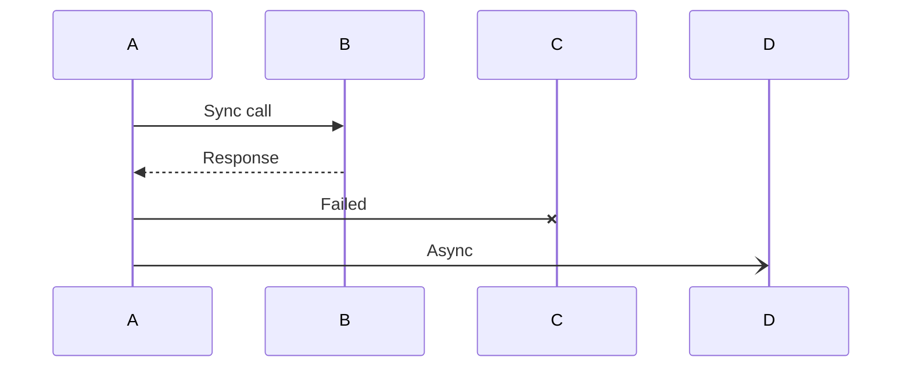

## Activations

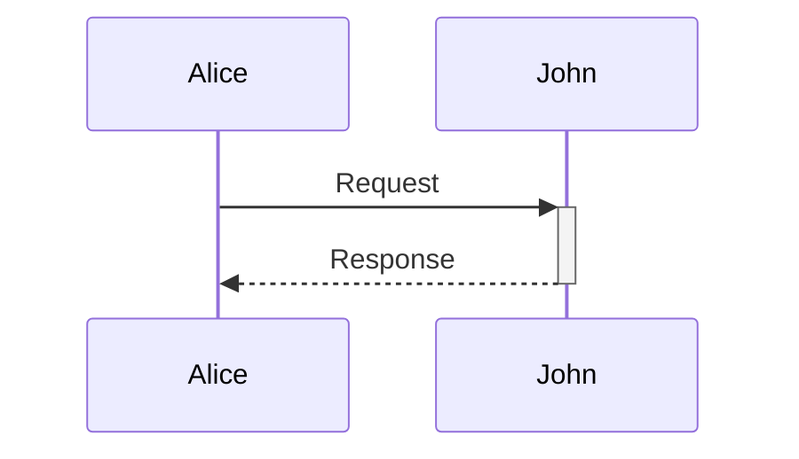

Or explicit:

```
activate John
...
deactivate John
```

## Notes

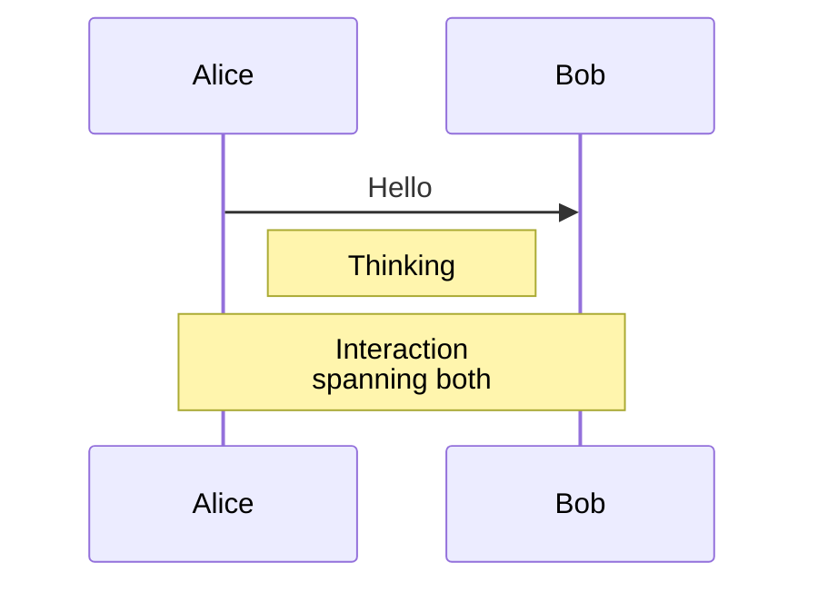

**Positions**: `left of`, `right of`, `over`

## Control Flow

**Loop**:

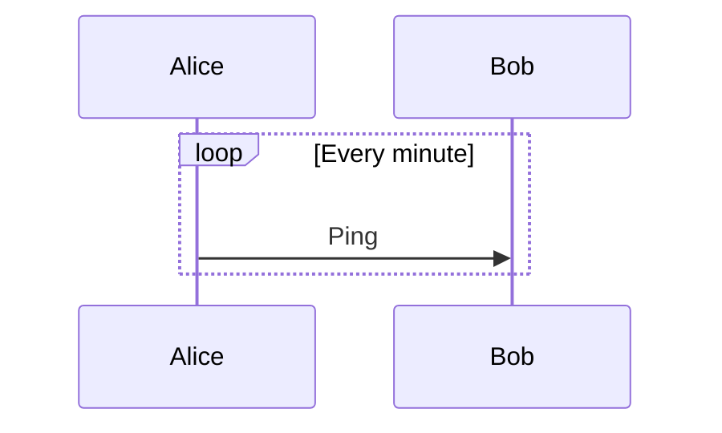

**Alt** (if/else):

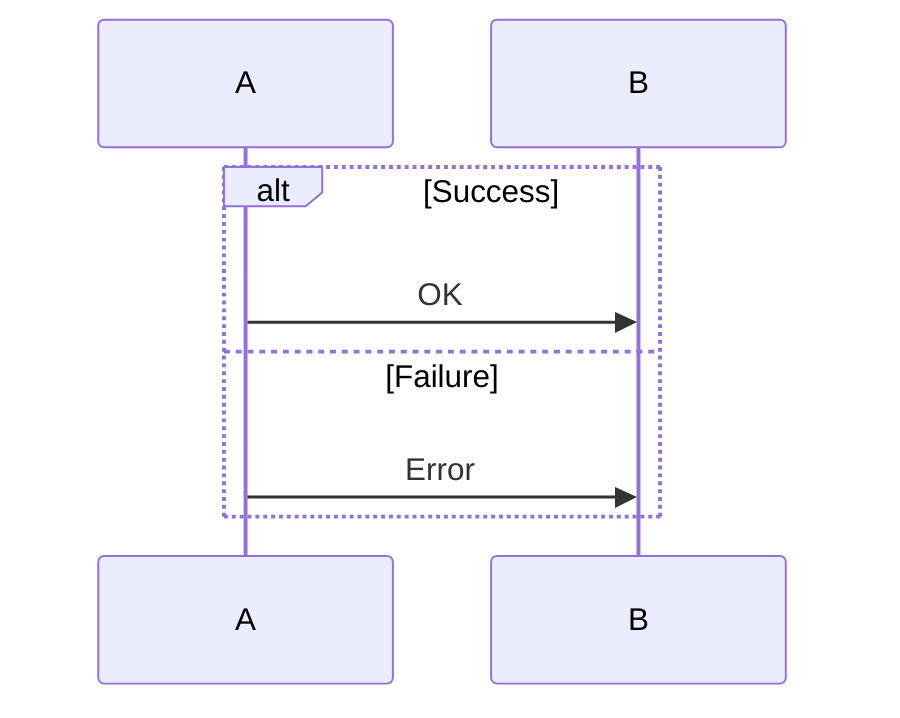

**Opt** (optional):

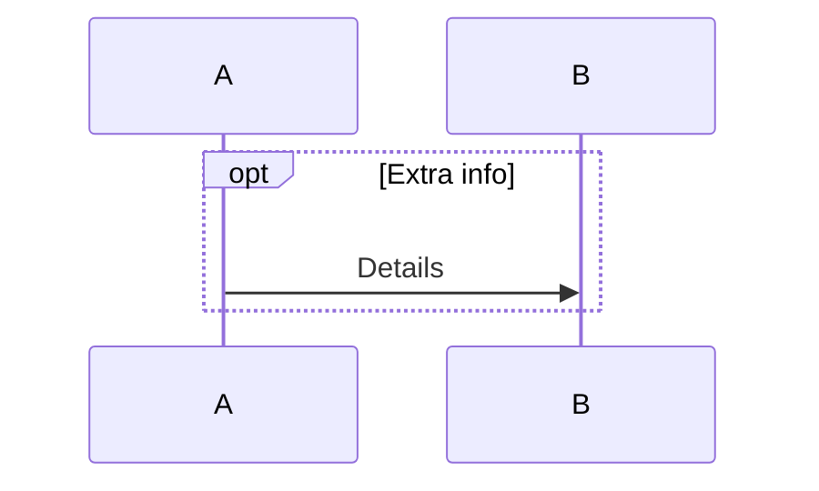

**Par** (parallel):

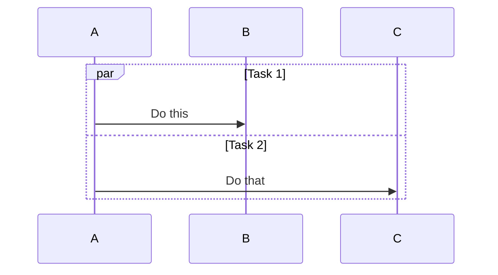

**Critical** (with options):

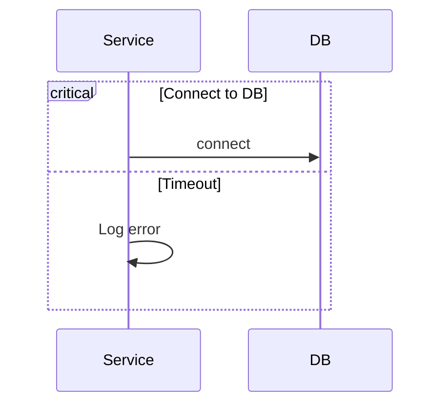

**Break**:

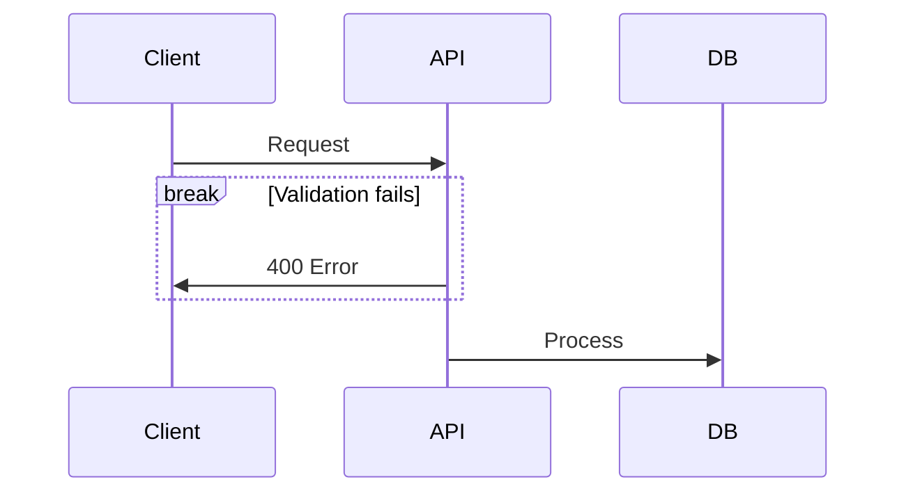

## Background Highlighting

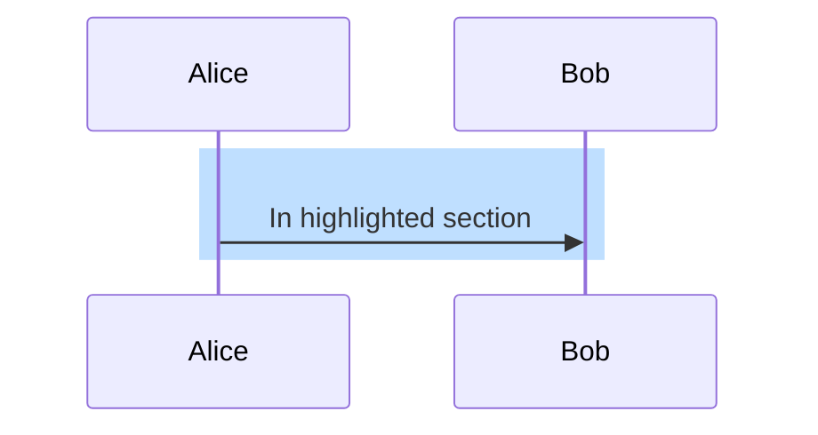

## Sequence Numbers

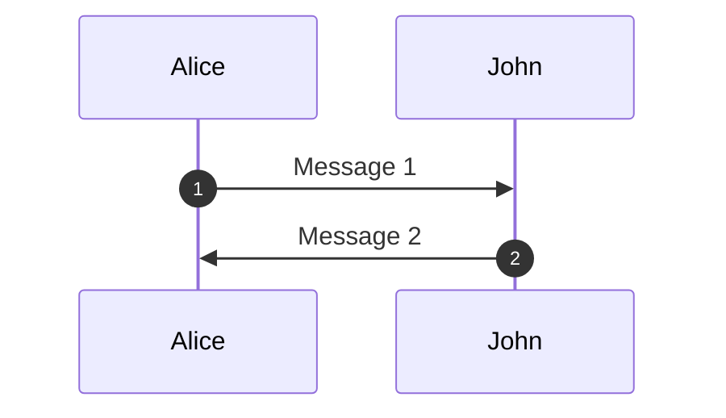

## Actor Links

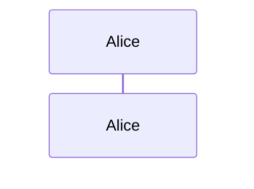

## Styling

CSS classes: `actor`, `messageLine0` (solid), `messageLine1` (dotted), `messageText`, `note`, `labelBox`, `loopLine`

```css
.actor {
  fill: #ececff;
  stroke: #ccccff;
}
.messageLine0 {
  stroke: black;
  stroke-width: 1.5;
}
.note {
  fill: #fff5ad;
  stroke: #decc93;
}
```

## Configuration

```javascript
mermaid.sequenceConfig = {
  mirrorActors: true, // Show actors top and bottom
  actorFontSize: 14,
  noteFontSize: 14,
  messageFontSize: 16,
};
```

## Examples

**Authentication**:

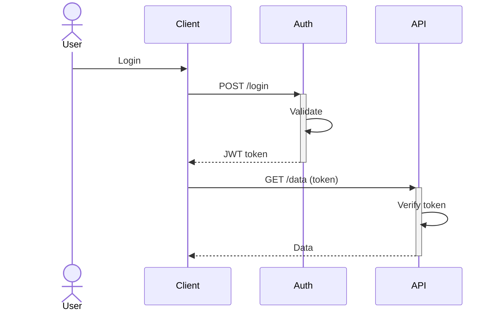

**Error handling**:

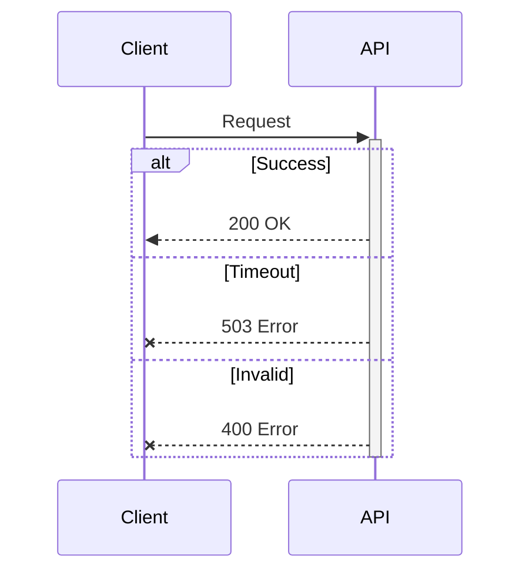

**Microservices**:

```mermaid
sequenceDiagram
    box Frontend
    participant Client
    end
    box Backend
    participant Gateway
    participant UserSvc
    participant OrderSvc
    end
    participant DB <<database>>

    Client->>Gateway: Create Order
    Gateway->>+UserSvc: Verify User
    UserSvc->>DB: Query
    UserSvc-->>-Gateway: Verified
    Gateway->>OrderSvc: Create
    OrderSvc->>DB: Insert
    Gateway-->>Client: 201 Created
```

## Best Practices

- **Participant order**: Define explicitly for control
- **Arrow types**: `->>` (sync call), `-->>` (response), `-)` (async), `-x` (error)
- **Activations**: Show processing time with `+`/`-`
- **Grouping**: Use boxes for system boundaries
- **Notes**: Document important steps
- **Error handling**: Use `alt` blocks
- **Simplicity**: Limit to 5-7 participants, focus on one scenario
- **Sequence numbers**: Enable with `autonumber` for complex flows

## Troubleshooting

| Issue                                     | Solution                                                                                                                                                                                                                                          |
| ----------------------------------------- | ------------------------------------------------------------------------------------------------------------------------------------------------------------------------------------------------------------------------------------------------- |
| "end" breaks diagram                      | Use `(end)`, `"end"`, or `{end}`                                                                                                                                                                                                                  |
| Special characters                        | Use entity codes or escape                                                                                                                                                                                                                        |
| Creation/destruction errors               | Requires v10.3.0+, use v10.7.0+ for bug fixes                                                                                                                                                                                                     |
| Using control keywords as participant IDs | Avoid using identifiers that match Mermaid control keywords (e.g. `loop`, `alt`, `par`, `end`, `opt`, `critical`). Use a different ID (e.g. `ForEachLoop`) or give a quoted label and a distinct short id (`participant FL as "Loop container"`). |

## Quick Reference

**Arrows**: `->`, `-->`, `->>`, `-->>`, `<<->>`, `-x`, `--x`, `-)`, `--)`
**Participants**: `participant`, `actor`, `<<database>>`, `<<queue>>`, `<<boundary>>`
**Control**: `loop`, `alt`/`else`, `opt`, `par`/`and`, `critical`/`option`, `break`
**Other**: `activate`/`deactivate`, `create`/`destroy`, `Note`, `rect`, `autonumber`, `box`, `link`

**Requires v10.3.0+**: create/destroy
**Requires v11.0.0+**: Bidirectional arrows

**Docs**: https://mermaid.js.org/syntax/sequenceDiagram.html
**Live Editor**: https://mermaid.live/
