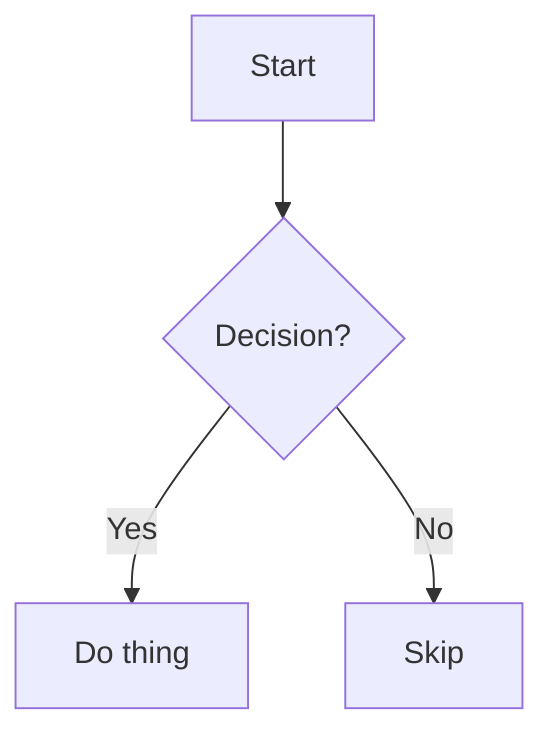
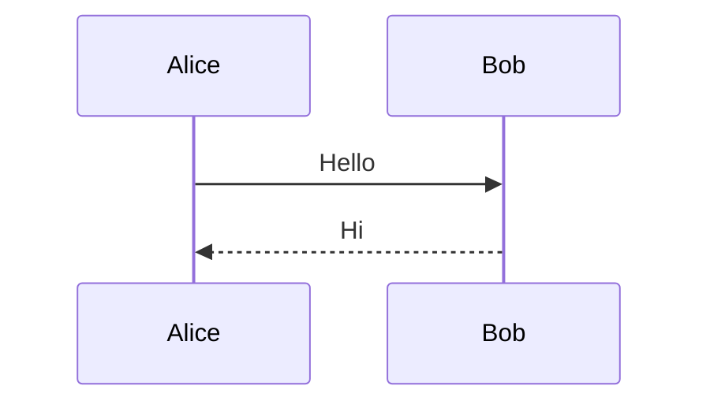

# Diagram in Markdown

Embed diagrams in Markdown. Route based on type:

| Diagram type                       | Method                        |
| ---------------------------------- | ----------------------------- |
| Flowchart                          | Mermaid codeblock             |
| Sequence diagram                   | Mermaid codeblock             |
| Architecture (AWS/Azure/GCP/infra) | D2 → SVG embedded in Markdown |

## Mermaid: Flowcharts & Sequence Diagrams

Embed directly as fenced codeblocks:

````markdown

````

````markdown

````

### Mermaid Quick Reference

**Flowchart:**

```
flowchart TD/LR/RL/BT    # direction
A[rectangle]             # node shapes: (), [], {}, (()), >], [[ ]]
A --> B                  # arrow
A -->|label| B           # labeled arrow
A -->{decision} B        # diamond
```

**Sequence:**

```
A->>B: sync message
A-->>B: async message
A-xB: lost message
Note right of A: text
```

## D2: Architecture Diagrams

When user asks for AWS, Azure, GCP, or infrastructure architecture diagrams, delegate to the `d2` skill.

### Workflow

1. **Load d2 skill** and its references (basic-syntax, special-use-cases, icon-links).
2. **Author** the `.d2` file with proper structure.
3. **Validate and format** with D2 CLI:
   ```bash
   d2 fmt diagram.d2
   d2 validate diagram.d2
   ```
4. **Export to SVG**:
   ```bash
   d2 diagram.d2 diagram.svg
   ```
5. **Embed in Markdown** using an HTML img tag (SVG embedding):
   ```markdown
   
   ```

### Example D2 → Markdown Output

```markdown
## System Architecture


The diagram above shows...
```

## Decision Rules

| User says                                                                | Use                      |
| ------------------------------------------------------------------------ | ------------------------ |
| "flowchart", "flow diagram"                                              | Mermaid                  |
| "sequence diagram", "interaction"                                        | Mermaid                  |
| "architecture diagram", "AWS", "Azure", "GCP", "infra", "system diagram" | D2 → SVG                 |
| "class diagram", "ERD"                                                   | Mermaid                  |
| Ambiguous (e.g. "make a diagram")                                        | Ask user to clarify type |

## Multi-Diagram Documents

A single Markdown doc can mix both: Mermaid for flows, D2 SVGs for architecture. No conflict — use each where it fits.
