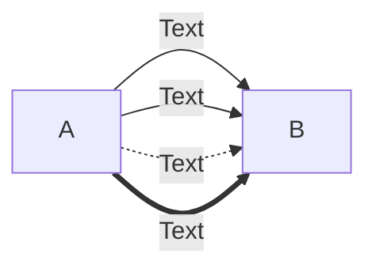
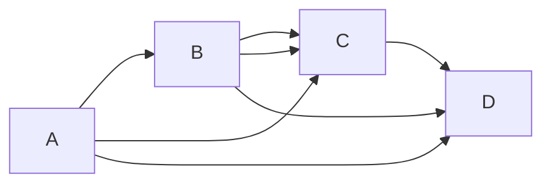
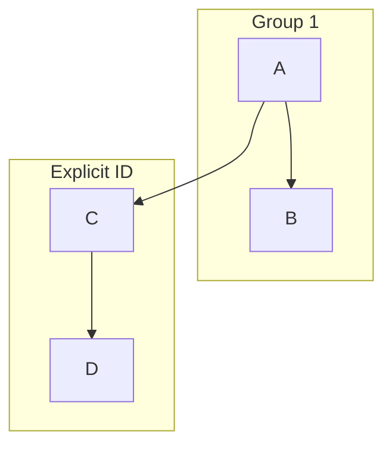
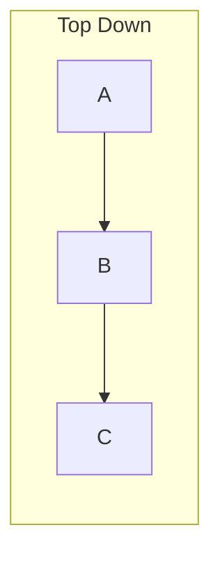
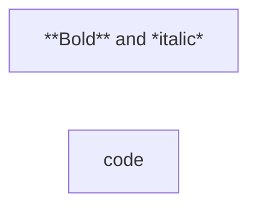
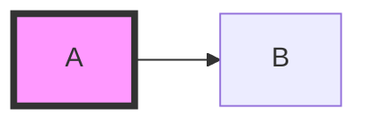
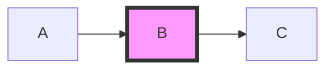
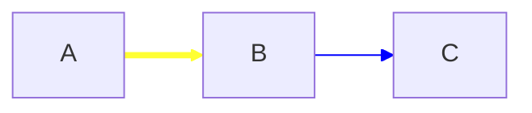
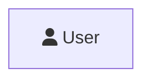

# Flowchart Syntax Reference

## Direction

| Value | Orientation        |
| ----- | ------------------ |
| TB/TD | Top to Bottom      |
| BT    | Bottom to Top      |
| RL    | Right to Left      |
| LR    | Left to Right      |


Can also use `graph` instead of `flowchart`.

## Basic Nodes

```mermaid
flowchart TD
    A                    %% default rectangle, id = label
    B[Text in box]       %% rectangle with text
    C(Round edges)       %% rounded rectangle
    D([Stadium])         %% stadium shape
    E[[Subroutine]]      %% subroutine
    F[(Database)]        %% cylinder
    G((Circle))          %% circle
    H>Asymmetric]        %% asymmetric (lean right)
    I{Rhombus}           %% diamond/decision
    J{{Hexagon}}         %% hexagon
    K[/Parallelogram/]   %% parallelogram
    L[\Parallelogram alt\] %% parallelogram alt
    M[/Trapezoid\]       %% trapezoid
    N[\Trapezoid alt/]   %% trapezoid alt
    O(((Double circle))) %% double circle
```

## Expanded Node Shapes (v11.3.0+)

Syntax: `A@{ shape: <name> }`

### Shape Quick Reference

| Shape Name    | Short Name   | Description            |
| ------------- | ------------ | ---------------------- |
| `rect`        | `proc`       | Standard process       |
| `rounded`     | `event`      | Rounded rectangle      |
| `stadium`     | `pill`       | Terminal point         |
| `fr-rect`     | `subproc`    | Subprocess             |
| `cyl`         | `db`         | Database/cylinder      |
| `circle`      | `circ`       | Start                  |
| `dbl-circ`    |              | Stop (double circle)   |
| `fr-circ`     | `stop`       | Stop (framed circle)   |
| `sm-circ`     | `start`      | Small circle start     |
| `diam`        | `decision`   | Decision (diamond)     |
| `hex`         | `prepare`    | Prepare/hexagon        |
| `lean-r`      | `in-out`     | Data input/output      |
| `lean-l`      | `out-in`     | Data output/input      |
| `trap-b`      | `priority`   | Priority action        |
| `trap-t`      | `manual`     | Manual operation       |
| `notch-rect`  | `card`       | Card                   |
| `lin-rect`    | `lin-proc`   | Lined/shaded process   |
| `fork`        | `join`       | Fork/join              |
| `hourglass`   | `collate`    | Collate                |
| `brace-l`     | `comment`    | Comment (left brace)   |
| `brace-r`     |              | Comment (right brace)  |
| `braces`      |              | Comment (both braces)  |
| `bolt`        | `com-link`   | Communication link     |
| `doc`         | `document`   | Document               |
| `delay`       |              | Delay                  |
| `h-cyl`       | `das`        | Direct access storage  |
| `lin-cyl`     | `disk`       | Disk storage           |
| `curv-trap`   | `display`    | Display                |
| `div-rect`    | `div-proc`   | Divided process        |
| `tri`         | `extract`    | Extract (triangle)     |
| `win-pane`    |              | Internal storage       |
| `f-circ`      | `junction`   | Junction               |
| `lin-doc`     |              | Lined document         |
| `notch-pent`  | `loop-limit` | Loop limit             |
| `flip-tri`    | `manual-file`| Manual file            |
| `sl-rect`     |              | Manual input           |
| `docs`        | `st-doc`     | Multi-document         |
| `st-rect`     | `processes`  | Multi-process          |
| `flag`        | `paper-tape` | Paper tape             |
| `bow-rect`    |              | Stored data            |
| `cross-circ`  | `summary`    | Summary                |
| `tag-doc`     |              | Tagged document        |
| `tag-rect`    | `tag-proc`   | Tagged process         |
| `datastore`   |              | Data store             |
| `text`        |              | Text block             |
| `bang`        |              | Bang                   |
| `odd`         |              | Odd                    |

### Icon Shape


Parameters: `pos` (`t`/`b`), `form` (`square`/`circle`/`rounded`), `label`, `h`, `w`.

### Image Shape

```mermaid
flowchart TD
    A@{ img: "https://example.com/logo.png", label: "Logo", pos: "t", w: 60, h: 60 }
```

Parameters: `pos` (`t`/`b`), `w`, `h`, `constraint` (`on`/`off`).

## Links (Edges)

### Basic Link Types

| Syntax    | Description               |
| --------- | ------------------------- |
| `A --> B` | Arrow head                |
| `A --- B` | Open link                 |
| `A -.-> B`| Dotted arrow              |
| `A -.- B` | Dotted open               |
| `A ==> B` | Thick arrow               |
| `A === B` | Thick open                |
| `A ~~~ B` | Invisible (for layout)    |
| `A --o B` | Circle end                |
| `A --x B` | Cross end                 |
| `A <--> B`| Bidirectional             |

### Text on Links



### Chaining



### Minimum Link Length

Extra dashes for longer links:

```mermaid
flowchart TD
    A ---> B    %% length 1 (normal)
    A ----> C   %% length 2
    A -----> D  %% length 3
```

| Length | Normal  | Arrow   | Thick   | Thick Arrow | Dotted  | Dotted Arrow |
| ------ | ------- | ------- | ------- | ----------- | ------- | ------------ |
| 1      | `---`   | `-->`   | `===`   | `==>`       | `-.-`   | `-.->`       |
| 2      | `----`  | `--->`  | `====`  | `===>`      | `-..-`  | `-..->`      |
| 3      | `-----` | `---->` | `=====` | `====>`     | `-...-` | `-...->`     |

### Edge IDs and Animation (v11.3.0+)

```mermaid
flowchart LR
    e1@A --> B
    e1@{ animate: true }
```

Animation speeds: `fast`, `slow`.

```mermaid
flowchart LR
    e1@A --> B
    e1@{ animate: fast }
```

## Subgraphs



### Direction in Subgraphs



**Limitation**: if any node links outside, subgraph direction ignored — inherits parent.

## Markdown Strings



Auto-wrapping enabled by default. Disable:

```yaml
---
config:
  markdownAutoWrap: false
---
```

## Interaction (Click Events)


Link targets: `_self`, `_blank`, `_parent`, `_top`.


Note: disabled with `securityLevel='strict'`.

## Comments


## Styling

### Node Style



### Classes



Multiple classes: `class node1,node2 className`
Default class: `classDef default fill:#f9f`

### Link Style



Multiple: `linkStyle 0,1 color:blue;`

### Line Curves

Diagram level:
```yaml
---
config:
  flowchart:
    curve: stepBefore
---
```

Edge level (v11.10.0+):
```mermaid
flowchart LR
    e1@A --> B
    e1@{ curve: "stepBefore" }
```

Available curves: `basis`, `bumpX`, `bumpY`, `cardinal`, `catmullRom`, `linear`, `monotoneX`, `monotoneY`, `natural`, `step`, `stepAfter`, `stepBefore`.

## FontAwesome Icons



Prefixes: `fa`, `fab`, `fas`, `far`, `fal`, `fad`, `fak` (custom).

Requires FontAwesome CSS loaded or icon pack registered.

## Entity Codes

- `#35;` for `#`
- `#quot;` for `"`
- HTML character names supported.

## Configuration

```yaml
---
config:
  flowchart:
    defaultRenderer: "elk"   # alt: dagre (default)
    curve: "linear"
---
```

`elk` renderer better for large/complex diagrams (v9.4+).

Width: `mermaid.flowchartConfig = { width: 100% }`
