# Sequence Diagram Syntax Reference

## Participants

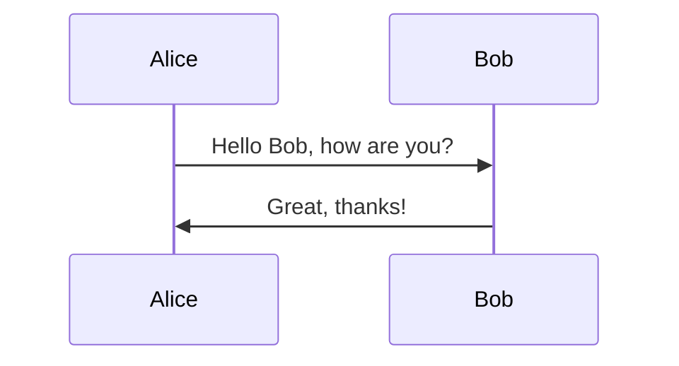

Implicit: participants render in order of first appearance.
Explicit order with `participant` keyword.

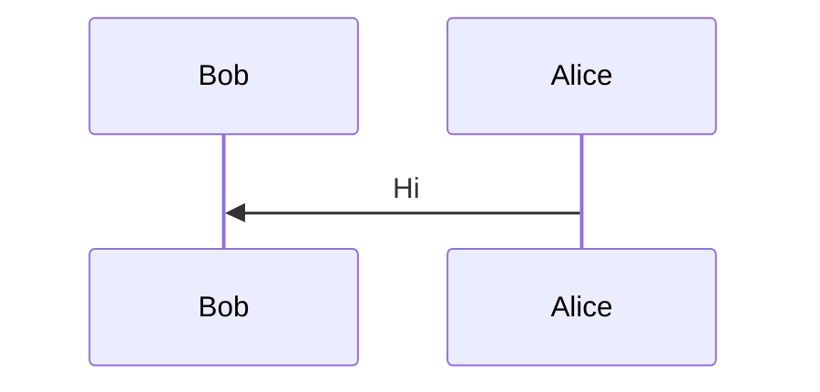

## Actors

Use `actor` for stick-figure symbol instead of rectangle.

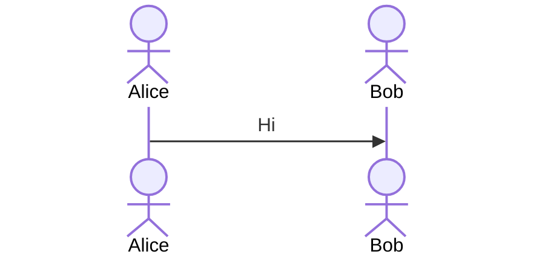

## Participant Shapes (JSON config)

```mermaid
sequenceDiagram
    participant A as Alice
    participant {"type": "boundary", "actor": "Boundary"} as B
    participant {"type": "control", "actor": "Control"} as C
    participant {"type": "entity", "actor": "Entity"} as E
    participant {"type": "database", "actor": "Database"} as D
    participant {"type": "collections", "actor": "Collections"} as CL
    participant {"type": "queue", "actor": "Queue"} as Q
```

## Aliases

**External syntax** (preferred):
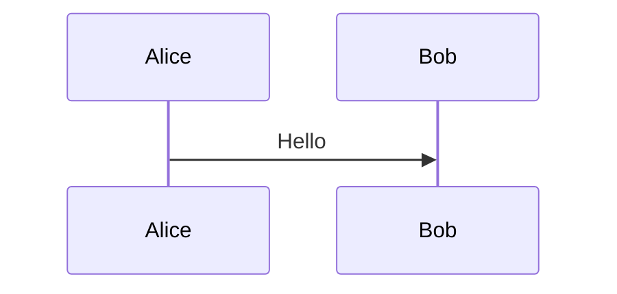

**With stereotype configs:**
```mermaid
sequenceDiagram
    participant {"type": "database", "actor": "DB"} as MyDatabase
    MyDatabase->>Alice: Query
```

**Inline alias:**
```mermaid
sequenceDiagram
    participant {"actor": "Alice", "alias": "A"} as Alice
```

**Precedence**: external `as` keyword overrides inline `"alias"`.

## Actor Creation/Destruction (v10.3.0+)

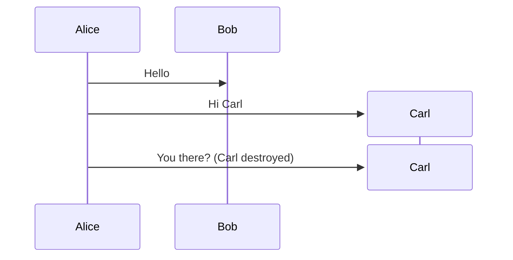

## Grouping / Box

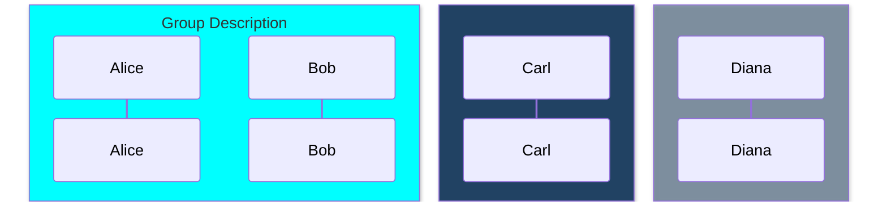

Color can be a named color, `rgb()`, `rgba()`, or `transparent`.

## Messages (Arrows)

### Standard Arrow Types

| Type   | Description                          |
| ------ | ------------------------------------ |
| `->`   | Solid line without arrow             |
| `-->`  | Dotted line without arrow            |
| `->>`  | Solid line with arrowhead            |
| `-->>` | Dotted line with arrowhead           |
| `<<->>`| Solid bidirectional (v11.0.0+)      |
| `<<-->>`| Dotted bidirectional (v11.0.0+)    |
| `-x`   | Solid line with cross at end         |
| `--x`  | Dotted line with cross at end        |
| `-)`   | Solid line with open arrow (async)   |
| `--)`  | Dotted line with open arrow (async)  |

### Half-Arrows (v11.12.3+)

Add extra `-` for dotted variant.

| Type   | Description                        |
| ------ | ---------------------------------- |
| `-\|`  | Top half arrowhead                 |
| `-\|/` | Bottom half arrowhead              |
| `/\|-` | Reverse top half arrowhead         |
| `\\-`  | Reverse bottom half arrowhead      |
| `-\\`  | Top stick half arrowhead           |
| `-//`  | Bottom stick half arrowhead        |
| `//-`  | Reverse top stick half arrowhead   |
| `\\-`  | Reverse bottom stick half arrowhead|

## Central Connections (v11.12.3+)

Append `()` to arrow for central lifeline connection:

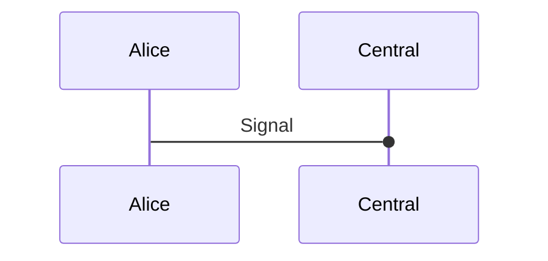

## Activations

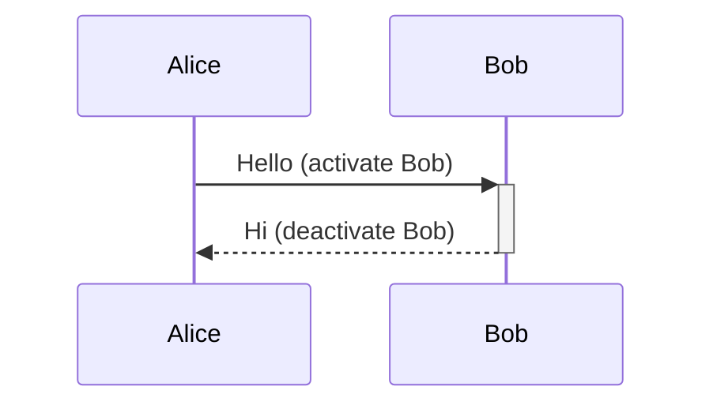

Stacked:
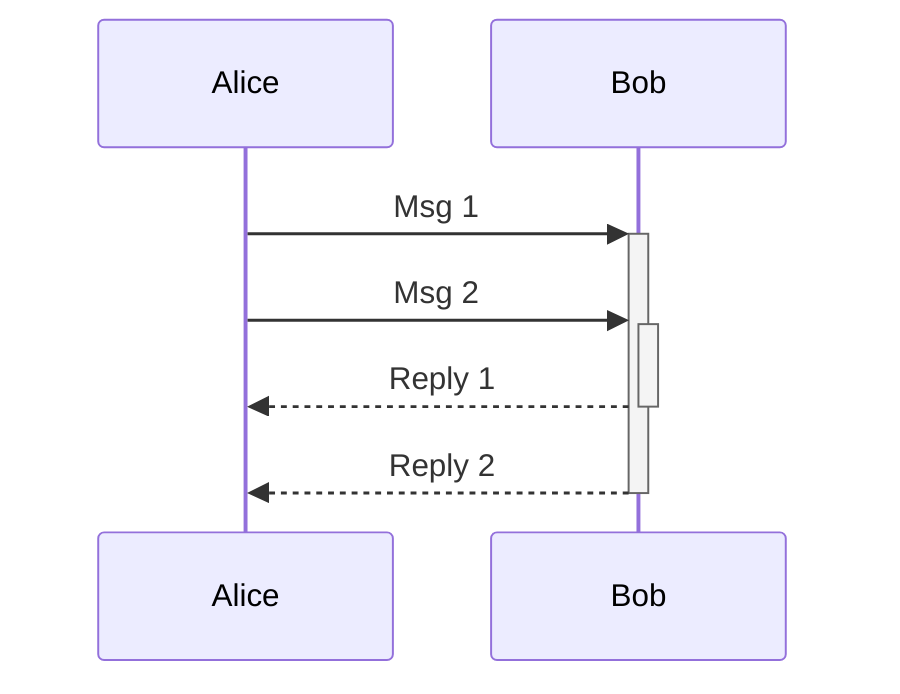

## Notes

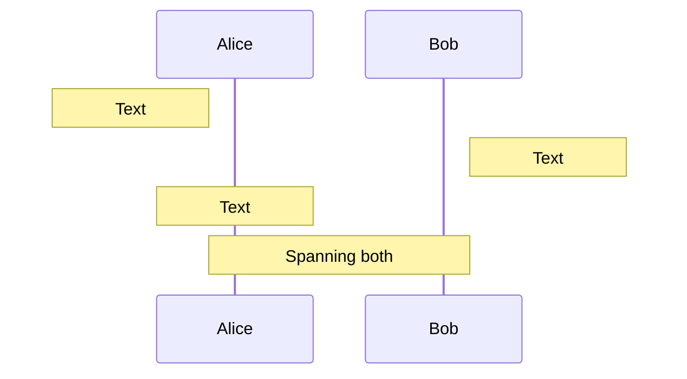

## Line Breaks

Use `<br/>` in messages and notes.

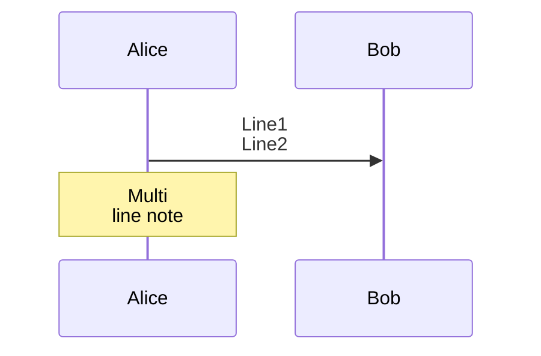

Actor names with line breaks require aliases.

## Loops

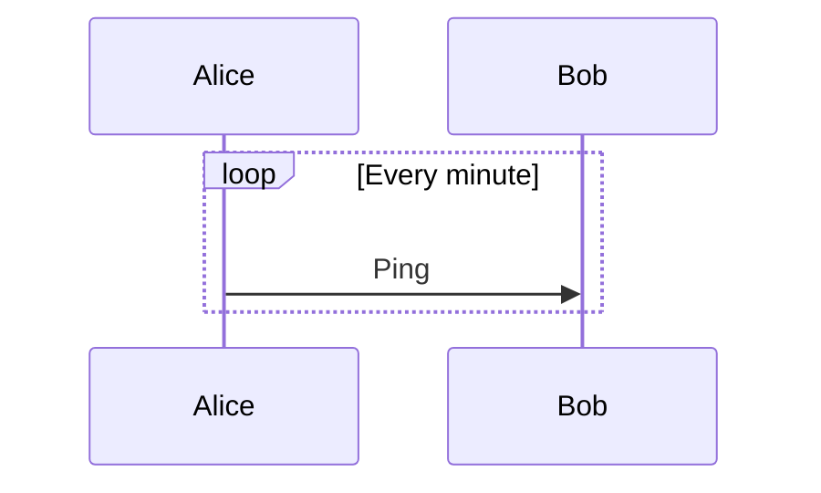

## Alt / Opt

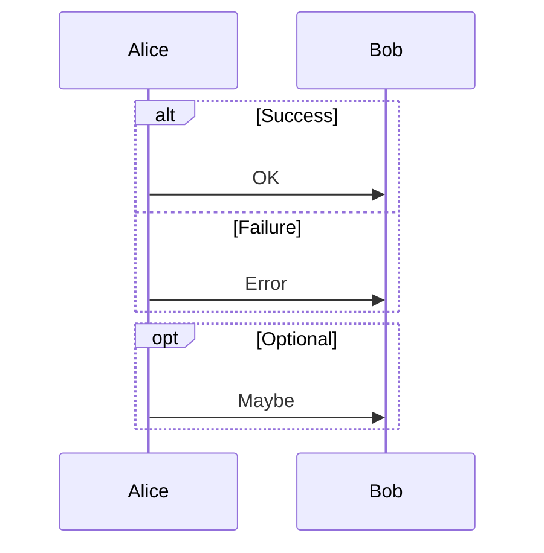

## Parallel

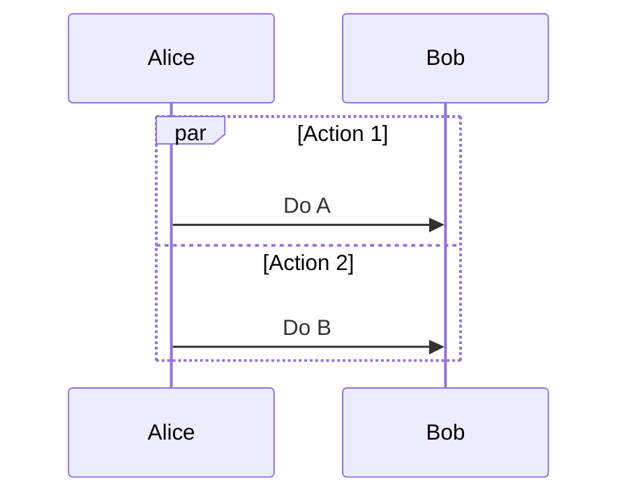

Nestable.

## Critical Region

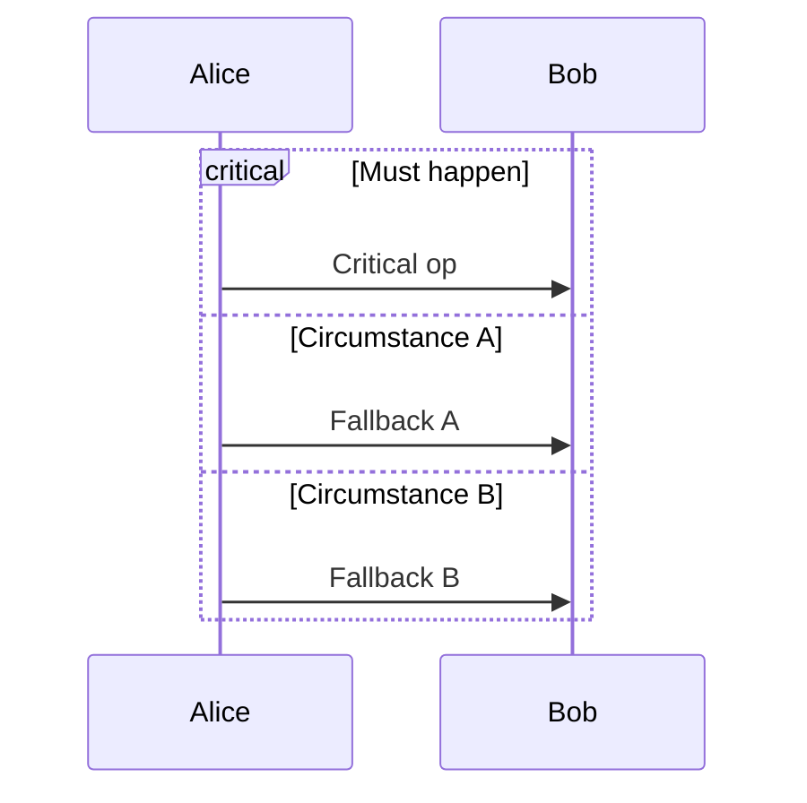

No options variant also supported. Nestable like `par`.

## Break

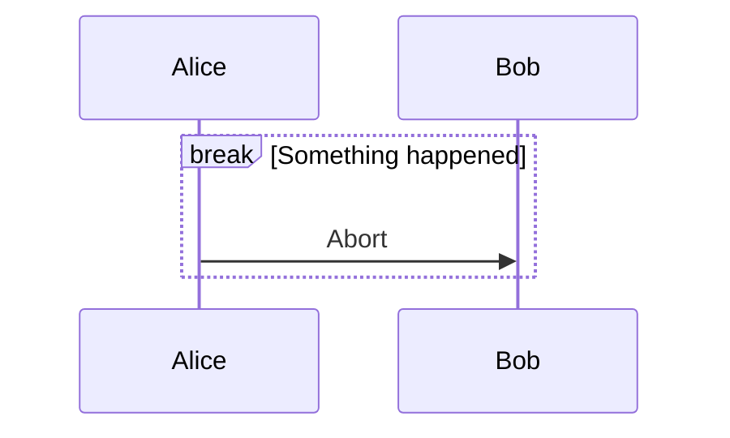

## Background Highlighting

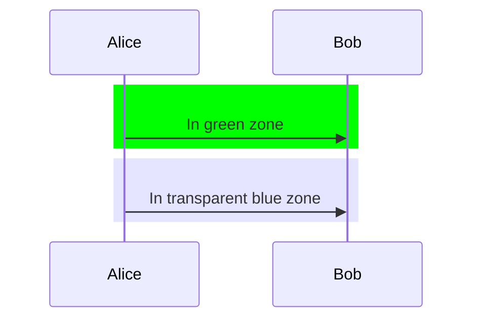

## Comments

```mermaid
sequenceDiagram
    %% This is a comment, ignored by parser
    Alice->>Bob: Hello
```

## Entity Codes (Escaping)

- `#35;` for `#`
- `#59;` for `;` (semicolon in message text)
- HTML character names supported.

## Sequence Numbers

Enable via config or diagram directive:

```mermaid
sequenceDiagram
    autonumber
    Alice->>Bob: Hello
    Bob->>Alice: Hi
```

### Start and Increment (v11.15.0+)

```mermaid
sequenceDiagram
    autonumber 10 5
    Alice->>Bob: Starts at 10, increments by 5
```

## Actor Menus

```mermaid
sequenceDiagram
    participant Alice
    link Alice: Dashboard @ https://dashboard.example.com
    link Alice: Wiki @ https://wiki.example.com
    Alice->>Bob: Hello
```

**Advanced (JSON):**
```mermaid
sequenceDiagram
    participant Alice
    links Alice: {"Dashboard": "https://dashboard.example.com", "Wiki": "https://wiki.example.com"}
```

## Configuration

```js
mermaid.sequenceConfig = {
    diagramMarginX: 50,
    diagramMarginY: 10,
    boxTextMargin: 5,
    noteMargin: 10,
    messageMargin: 35,
    mirrorActors: true,
};
```

| Parameter           | Default                        |
| ------------------- | ------------------------------ |
| mirrorActors        | false                          |
| bottomMarginAdj     | 1                              |
| actorFontSize       | 14                             |
| actorFontFamily     | "Open Sans", sans-serif        |
| noteFontSize        | 14                             |
| noteFontFamily      | "trebuchet ms", verdana, arial |
| noteAlign           | center                         |
| messageFontSize     | 16                             |
| messageFontFamily   | "trebuchet ms", verdana, arial |
